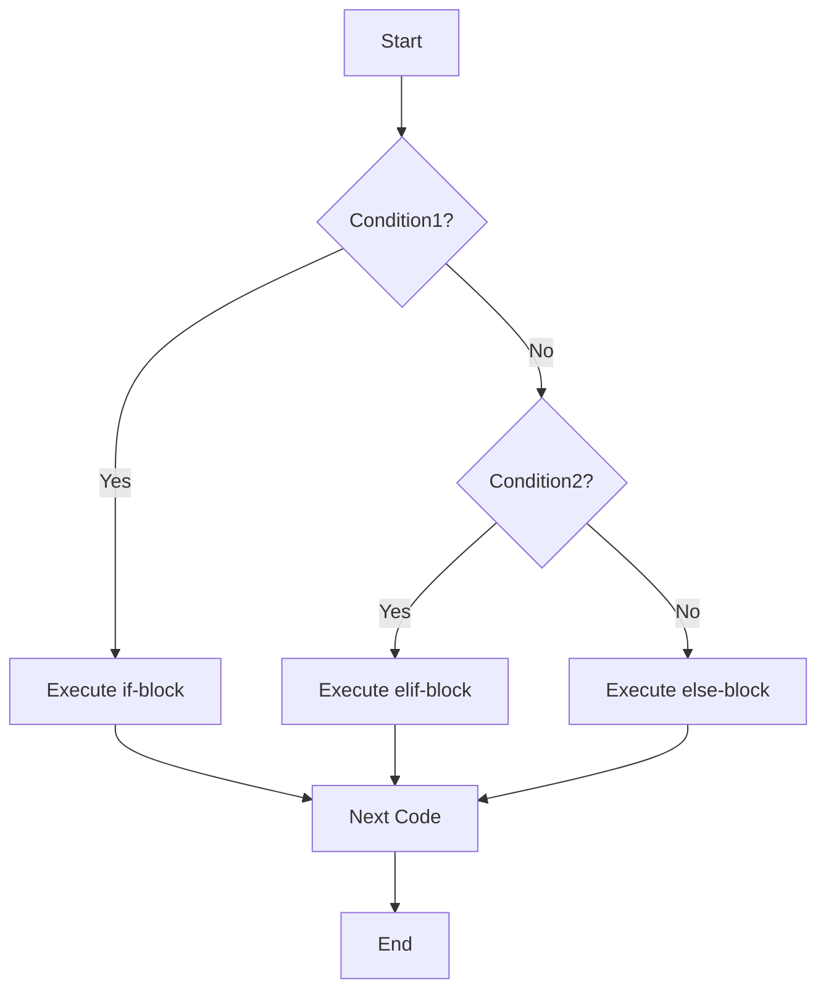

# Python Beginner Micro Course

## Executive Summary  
This micro-course covers Python basics for absolute beginners, using simple language and classroom analogies. It starts with what Python is and how to install it, then explains fundamental concepts step by step: how to output with `print()`, how to store data in variables, common data types, how to get user input, using operators, and controlling program flow with conditions and loops. Each section explains every symbol (e.g. quotes, parentheses, colons), shows code examples with output, points out common mistakes, and ends with short exercises. At the end are 5 exam-style questions and a TL;DR cheat-sheet. Throughout, we use official Python documentation examples and simple analogies (e.g. “variables are labeled boxes”) to make learning easy. The course assumes no prior knowledge of editors or how to run Python code – we explain each step. 

## Table of Contents  
1. [Introduction](#1-introduction)  
2. [Installation](#2-installation)  
3. [`print()` Function](#3-print-function)  
4. [Variables](#4-variables)  
5. [Data Types](#5-data-types)  
6. [Input](#6-input)  
7. [Operators](#7-operators)  
8. [Conditions (if/elif/else)](#8-conditions-if-elif-else)  
9. [Loops (`for` and `while`)](#9-loops-for-and-while)  
10. [Functions](#10-functions)  
11. [TL;DR Cheat Sheet](#11-tldr-cheat-sheet)  
12. [Mini-Exam Questions](#12-mini-exam-questions)  
13. [Sources](#13-sources)  

## 1. Introduction  
Python is a popular, high-level programming language known for its clear and easy-to-learn syntax. In Python, code and punctuation resemble English (e.g. `if`, `print`, `:`), and blocks of code are grouped by indentation (tabs or spaces). As Python’s official site notes, beginners find its clean syntax and indentation “easy to learn”. You can think of Python like a friendly, programmable robot or smart calculator that understands commands written in plain English-like form. 

For example, Python supports simple math out of the box:  
```python
>>> 1 + 2
3
>>> 2 ** 3  # 2 to the power of 3 (exponent)
8
```  
(Here `+` adds numbers and `**` means “power of”.) 

Python can be run in two ways: interactively or from a file. Interactive mode means typing commands at the `>>>` prompt (the Python shell) and immediately seeing results. Writing code in a file (ending in `.py`) means you save your program and run it all at once (e.g. `python myfile.py` in a terminal). We’ll explain running code more in the next section.  

**Analogy:** Think of Python as a scientist’s notebook or a lab assistant. You give it instructions (code) step by step, and it performs calculations or tasks for you. The `>>>` prompt is like giving a live command to the assistant and seeing the answer immediately. 

## 2. Installation  
Before writing Python code, you need Python installed. Download the latest Python **3.x** version (Python 2 is outdated) from the official site [python.org/downloads]. Python 3 is the current standard; make sure you have Python 3.x (e.g. 3.14.6). 

After installing, you can check that Python is ready. Open a command prompt or terminal and type:  
```bash
python --version
```  
or on Windows:  
```bash
py --version
```  
This should display the Python version (e.g. `Python 3.14.6`). If you see a 2.x version, install Python 3 instead. The Python wiki suggests using these commands to verify installation. 

**Running a Python file:** After installing, you can write Python code in a text editor or IDE (like VS Code). Save the file as `example.py`. Then run it in a terminal:  
```bash
python example.py
```  
This executes your Python program.  

**Example:** Create a file `hello.py` with one line:  
```python
print("Hello, Python!")
```  
Run it:  
```bash
python hello.py
```  
Output:  
```
Hello, Python!
```  
If you see your message, Python is working!  

**Common Mistakes:**  
- Forgetting to install Python 3, or keeping Python 2 on your system. Always use Python 3.  
- Running `python` without quotes or as `Python` (commands are case-sensitive).  
- Not adding Python to your system PATH (on Windows, check “Add Python to PATH” in the installer).  

**Exercises:**  
1. After installing Python, run `python --version` (or `py --version` on Windows). What does it show?  
2. Write and run a file `test.py` that contains `print("Test successful!")`. Does it print correctly?  
3. Open Python interactively by typing `python` or `py`. At the `>>>` prompt, type `print("Hi")`. What happens?

## 3. `print()` Function  
The `print()` function outputs text or values to the screen (standard output). Whatever you put inside the parentheses is printed. Text must be in quotes (either single `'...'` or double `"..."` for strings). Variables or numbers can be printed directly. 

**Syntax and symbols:** `print` is the function name. The parentheses `()` hold its arguments (what to print). Commas inside `print()` separate multiple items, and by default print inserts a space between them.  

**Examples:**  
```python
print("Hello, World!")   # prints text (string) Hello, World!
print(2 + 3)             # prints the result of the expression 2+3, which is 5
print("Sum is", 2 + 3)   # prints "Sum is 5" with a space in between
```  
Output:  
```
Hello, World!
5
Sum is 5
```  
(Note: `2+3` is an expression; its value 5 is printed. Strings like `"Hello"` are printed without the quotes.) 

Another example from Python docs:  
```python
i = 256 * 256
print('The value of i is', i)
```  
This outputs:  
```
The value of i is 65536
```  
as shown in the tutorial. (Notice the quotes around the message are not printed; only the text appears.)

**Common Mistakes:**  
- Forgetting parentheses. In Python 3, `print` is a function, so you must write `print(...)`. Writing `print "Hello"` (no parentheses) causes a syntax error.  
- Missing quotes around text. `print(Hello)` looks like a variable `Hello`, not the string "Hello". Always put quotes around text.  
- Typos: Spelling `Print` or `PRINT` won’t work (case matters).  
- Using commas or concatenation incorrectly. For example, `print("Number is" 5)` is wrong (missing comma or plus).  

**Exercises:**  
1. Use `print()` to display your name in quotes, e.g. `print("YourName")`.  
2. Use `print()` to display `7 * 3` as text and its result: e.g. `print("7 * 3 =", 7*3)`.  
3. Try `print()` with no arguments (empty parentheses). What happens?  
4. Predict the output:  
   ```python
   print("Hello", "there")
   ```  
5. What’s wrong with `print 'Hello'`? Fix it.

## 4. Variables  
A **variable** is like a labeled box that holds a value (data). You give the box a name, then put a value inside it. In Python, you assign a value to a variable with the `=` sign. The left side is the variable name, the right side is the value or expression. 

**Example:**  
```python
a = 10       # assign the integer 10 to variable a
b = 5
c = a + b    # c gets the value 15
print(a, b, c)
```  
Output:  
```
10 5 15
```  
Explanation: `a = 10` assigns 10 to `a`; `b = 5` to `b`. Then `c = a + b` computes 10+5 and stores 15 in `c`. The `print(a, b, c)` shows the values of `a`, `b`, and `c`. 

As the official tutorial explains: *“The equal sign (`=`) is used to assign a value to a variable”*. After assignment, the interactive prompt shows no output (the value is stored, not printed). 

**Using undefined variables:** If you try to use a variable that has not been assigned, you get a NameError. For example,  
```python
print(x)  # x has no value yet
```  
causes:  
```
NameError: name 'x' is not defined
```  
because `x` has no value yet. Always assign before using. 

**Variable names:** Names should start with a letter or underscore (`_`), not a number, and can contain letters, digits, or underscores. Names are case-sensitive (`age` and `Age` are different). By convention, use meaningful names (like `width`, `name`, etc.). 

**Common Mistakes:**  
- Using `=` instead of `==` in comparisons (see conditions section). Remember `=` means assignment, `==` means comparison.  
- Forgetting to assign before use (NameError).  
- Using illegal names (like starting with a digit).  
- Reusing `print` as a variable name (or other Python keyword). Don’t name a variable `print` or `if`. 

**Exercises:**  
1. Assign values to two variables, e.g. `x = 4` and `y = 7`, then print them.  
2. Change the value of `x` to `10` after the first assignment, and print `x` and `y` again.  
3. What happens if you try `print(z)` without defining `z` first?  
4. Swap two variables: if `a = 1` and `b = 2`, write code so that their values are swapped (hint: use a third variable or multiple assignment `a, b = b, a`).  

## 5. Data Types  
Data in Python has **types**. Here are common types: integers, floats, strings, booleans, and collections like lists, tuples, and dictionaries. We summarize key types below:

| Type    | Example          | Description                                                  |
|---------|------------------|--------------------------------------------------------------|
| `int`   | `42`             | Integer (whole number)                                      |
| `float` | `3.14`           | Floating-point number (decimal)              |
| `str`   | `"hello"`        | String of text in quotes                     |
| `bool`  | `True` or `False`| Boolean truth value (True/False)                            |
| `list`  | `[1, 2, 3]`      | List of items (mutable sequence)           |
| `tuple` | `(1, 2, 3)`      | Tuple of items (immutable sequence)        |
| `dict`  | `{"a": 1}`       | Dictionary (key: value mapping)              |
| `range` | `range(5)`       | Sequence of numbers 0..4 (used in loops)   |

**Notes:**  
- **Integers vs Floats:** Integers (`int`) are whole numbers; floats (`float`) have decimals. For example, `5` is an `int`, `5.0` or `2.718` are `float`. The calculator example in docs shows `5.0` is float.  
- **Strings:** Text is a string (`str`). You write it in quotes. Both single `'hello'` and double `"hello"` quotes work the same. E.g., `'Python'` is a string.  
- **Boolean:** Values `True` and `False` (capitalized) are the two booleans. Conditions evaluate to these.  
- **List and Tuple:** Lists use square brackets `[]` and can change (mutable). Tuples use parentheses `()` or commas and cannot change (immutable).  
- **Dictionary:** Use `{}` with key:value pairs. E.g. `{"name": "Alice", "age": 30}`. Keys are unique and lookups are fast. The example in docs `{ 'one': 1, 'two': 2 }` shows a dict.  
- **Range:** `range(n)` gives numbers from 0 up to n-1. Useful in loops (see next sections). For example, `list(range(5))` is `[0, 1, 2, 3, 4]`.

You can check a value’s type with `type()`:  
```python
print(type(42))       # <class 'int'>
print(type(3.14))     # <class 'float'>
print(type("hi"))     # <class 'str'>
print(type(True))     # <class 'bool'>
```

**Common Mistakes:**  
- Mixing types without conversion (e.g. adding a number and string: `"age: " + 30` errors because 30 is int, not string). You’d need to convert: `"age: " + str(30)`.  
- Forgetting list `[]` or tuple `()` notation. E.g. writing `a = 1,2,3` makes a tuple by the comma, but it’s not obvious to beginners.  
- Using dictionary braces `{}` but forgetting colons `:` between key and value.  

**Exercises:**  
1. What is the type of `100`, `100.0`, and `"100"`? (Use `type()` to check.)  
2. Create a list of 3 items and print it. Then change one item and print again.  
3. Write a tuple of 3 strings (e.g. names) and print its length.  
4. Make a dictionary mapping two words to their definitions (e.g. `{"apple": "fruit", "table": "furniture"}`) and print it.  
5. Using `range`, write a loop to print numbers 0 through 4 (Hint: `range(5)`).  

# Part 2

## 6. Input  
To get input from the user, Python uses the `input()` function. When `input(prompt)` is called, it displays the prompt (if given) and waits for the user to type something, then returns that input as a string. Always remember `input()` returns a string, even if the user types digits – you must convert it to `int` or `float` if you need a number. 

**Example:**  
```python
name = input("Enter your name: ")   # ask user for name
# (User types: Alice and presses Enter)
print("Hello, " + name + "!")
```  
Output:  
```
Enter your name: Alice
Hello, Alice!
```  
(Here `input` printed the prompt and took `Alice` as input. The code then prints a greeting.) This is similar to the example in the tutorial:  
```python
>>> s = input('--> ')
--> Monty Python's Flying Circus
>>> s
"Monty Python's Flying Circus"
```  
which shows the prompt and the entered string. 

**Common Mistakes:**  
- Forgetting `str()` conversion: e.g., `age = input("Age: ")` then `print(age + 5)` will error because `age` is a string, not a number. Fix: `int(input(...))`.  
- Using `input()` in places where no prompt is given can confuse the user (always give a clear prompt).  
- Pressing Enter without typing anything gives an empty string `""`. 

**Exercises:**  
1. Write code that asks for the user’s favorite color and then prints “I like [color] too!”.  
2. Write code that asks for two numbers (use two `input()` calls), converts them to integers, adds them, and prints the result.  
3. What is the type of the value returned by `input()`? (Use `type()` to check.)  
4. Try entering a number with `input()` and immediately printing it. Then try converting it to `int` or `float`.  

## 7. Operators  
Operators perform operations on values. The main types are arithmetic operators (`+`, `-`, `*`, `/`, `//`, `%`, `**`), comparison operators (`==`, `!=`, `<`, `>`, `<=`, `>=`), and boolean (logical) operators (`and`, `or`, `not`). 

- **Arithmetic:** `+` (add), `-` (subtract), `*` (multiply), `/` (divide, result is float). For example:  
  ```python
  print(2 + 3, 10 - 4, 5 * 6, 8 / 2)  
  ```  
  Output:  
  ```
  5 6 30 4.0
  ```  
  Python also supports integer (floor) division `//` and modulus `%` (remainder):  
  ```python
  print(17 // 3, 17 % 3, 5 ** 2)  
  ```  
  Output:  
  ```
  5 2 25
  ```  
  Explanation: `17 // 3` is 5 (integer part of 5.666…), `17 % 3` is 2 (remainder), and `5 ** 2` is 25 (5 squared).  

- **Comparison:** `==` (equals), `!=` (not equals), `<`, `>`, `<=`, `>=`. These compare two values and give `True` or `False`. Example:  
  ```python
  print(5 == 5, 5 != 3, 4 < 7, 7 >= 7)
  ```  
  Output:  
  ```
  True True True True
  ```  
  Here `5 == 5` is `True`, `5 != 3` is `True`, and so on. (Important: use `==` to compare; a single `=` is assignment!)

- **Logical (`and`, `or`, `not`):** Combine comparisons: `and` is true if both sides are true, `or` if at least one side is true, `not` flips True/False. Example:  
  ```python
  print(True and False, True or False, not True)
  ```  
  Output:  
  ```
  False True False
  ```  

**Common Mistakes:**  
- Using a single `=` inside an `if` (should be `==` for comparison).  
- Division by zero (`5/0`) will cause an error.  
- Mixing types without conversion, e.g. `"2" + 3` (cannot add string and int).  
- Using `and/or` with non-boolean values can lead to unexpected results (see official docs for truth-testing of values, but as a beginner, stick to boolean expressions).  

**Exercises:**  
1. Calculate and print `7 // 3` and `7 % 3`. What do they represent?  
2. Use comparison operators to check if `10` is greater than `3` and if `2` equals `5`.  
3. What is the output of `print( (3 + 5) * 2 )`? Why is there a space in the multiplication?  
4. Given `x = 4`, `y = 9`, what does `print(x * y == 36)` print?  
5. Write a boolean expression using `and`/`or` that checks if a number `n` is between 1 and 10 (inclusive).

## 8. Conditions (if/elif/else)  
Conditions let your program make decisions. The `if` statement checks a condition (True/False). Its basic form:  
```python
if condition:
    # code to run if condition is true
```
Optionally, use `elif` (else-if) and `else` for other branches. The syntax requires a colon `:` after `if`, `elif`, or `else`, and indent the code block under it. 

**Example:**  
```python
x = -5
if x < 0:
    print("Negative")
elif x == 0:
    print("Zero")
else:
    print("Positive")
```  
Output (for `x = -5`):  
```
Negative
```  
This matches the example in Python docs. Here, `x < 0` is True, so it prints "Negative". If `x` were `0`, it would print "Zero", etc. The `elif` keyword is short for “else if”. You can have zero or more `elif` blocks, and an optional `else` that runs if no previous condition was true. 

**Indentation:** Note that the print statements are indented by the same amount under each `if`/`elif`/`else` line. This indentation (usually 4 spaces) groups the block together. All lines of a block must align. 

**Mermaid Diagram of an if-elif-else flow:**  


**Common Mistakes:**  
- Forgetting the colon (`:`) after `if`/`elif`/`else`.  
- Incorrect indentation (all lines in the block must be indented the same).  
- Using `=` instead of `==` in the condition.  
- Not covering all cases; e.g., missing an `else` might skip all blocks if conditions fail. 

**Exercises:**  
1. Write an `if` statement that prints "Even" if a number `n` is even, and "Odd" otherwise. (Hint: use `n % 2 == 0`.)  
2. Given `score = 85`, write code that prints "Grade A" if `score >= 90`, "Grade B" if `score >= 80`, else "Grade C".  
3. What does the following code print? Explain.  
   ```python
   x = 10
   if x > 5:
       print("big")
   elif x > 8:
       print("bigger")
   else:
       print("small")
   ```  
4. Identify the error in:  
   ```python
   if x = 3:
       print("x is 3")
   ```  

## 9. Loops (`for` and `while`)  
Loops repeat actions. Python has `for` and `while` loops. 

- **`for` loops:** Iterate over items of a sequence (like a list or string) or a range of numbers. For example:  
  ```python
  fruits = ["apple", "banana", "cherry"]
  for f in fruits:
      print(f)
  ```  
  Output:  
  ```
  apple
  banana
  cherry
  ```  
  Or looping a range of numbers:  
  ```python
  for i in range(3):
      print(i)
  ```  
  Output:  
  ```
  0
  1
  2
  ```  
  (Here `range(3)` gives 0,1,2.)  

- **`while` loops:** Repeat as long as a condition is true. For example, the classic Fibonacci example from the docs:  
  ```python
  a, b = 0, 1
  while a < 10:
      print(a)
      a, b = b, a + b
  ```  
  Output:  
  ```
  0
  1
  1
  2
  3
  5
  8
  ```  
  (This prints Fibonacci numbers less than 10.)  

Both loop bodies end with the code block indented under `for` or `while`. The loop repeats until the `for` has no more items, or the `while` condition becomes False. 

**Mermaid Diagram of a loop flow:**  
```mermaid
flowchart TD
    A[Start] --> B[Initialize counter or loop]
    B --> C{Condition true?}
    C -- Yes --> D[Execute loop body]
    D --> E[Update variables (e.g., increment)]
    E --> C
    C -- No  --> F[Exit loop]
```  

**Common Mistakes:**  
- **Infinite loops:** In a `while` loop, if the condition never becomes False (e.g. forgetting `a += 1`), the loop never ends.  
- Indentation errors inside loops (must indent the body).  
- Off-by-one errors with `range()`: remembering that `range(3)` stops before 3.  
- Modifying a list while iterating over it (advanced issue – avoid changing the loop variable in a `for`).

**Exercises:**  
1. Use a `for` loop to print the squares of numbers 1 through 5.  
2. Use a `while` loop to print numbers from 5 down to 1.  
3. What does this code print?  
   ```python
   for i in [2, 4, 6]:
       print(i // 2)
   ```  
4. Write a loop that prints the first 6 Fibonacci numbers (0,1,1,2,3,5).  
5. Identify the problem:  
   ```python
   i = 0
   while i < 5:
       print(i)
   ```  

## 10. Functions  
A **function** is a named block of code you can call with parameters. Define a function with `def`, give it a name, parameters in parentheses, and a colon. The body is indented. For example:  
```python
def greet(name):
    """Greet the person by name."""
    print("Hello, " + name + "!")
# Call the function:
greet("Alice")
```  
Output:  
```
Hello, Alice!
```  
This shows a function `greet` taking one argument. The `"""..."""` is a *docstring* (optional description). 

Return values: Use `return` to output a value from a function. Example:  
```python
def add(x, y):
    return x + y
result = add(2, 3)
print(result)
```  
Output:  
```
5
```  
If a function has no `return`, it returns `None` by default (though this is usually not printed).  

**Common Mistakes:**  
- Forgetting the colon after `def`.  
- Incorrect indentation of the function body.  
- Not calling the function (omitting parentheses).  
- Assuming a function returns something when it doesn’t (`None`).  

**Exercises:**  
1. Write a function `square(n)` that returns the square of `n`. Then call it with `n=4` and print the result.  
2. Fix the error in this function:  
   ```python
   def add(a, b)
       return a + b
   ```  
3. What does this code print? Explain the steps.  
   ```python
   def foo():
       print("Inside foo")
   foo()
   ```  
4. Write a function that asks for two numbers (using `input()`) and returns their product.  

## 11. TL;DR Cheat Sheet  
- **Comments:** Use `#` at line start or after code for notes.  
- **`print(x)`:** Print value or text `x` to screen. Strings need quotes, variables don’t.  
- **Variables (`=`):** Store values. E.g. `a = 10`. Using `=` assigns, `==` compares.  
- **Data Types:**  
  - `int`: whole numbers (e.g. `5`).  
  - `float`: decimals (e.g. `3.14`).  
  - `str`: text in quotes (e.g. `"Hello"` or `'Hello'`).  
  - `bool`: `True` or `False`.  
  - `list`: `[1,2,3]` (changeable).  
  - `tuple`: `(1,2,3)` (immutable).  
  - `dict`: `{"key": value}` pairs.  
- **`type(x)`:** Shows the type of `x`.  
- **`input(prompt)`:** Reads user input as a *string*.  
- **Operators:**  
  - Arithmetic: `+`, `-`, `*`, `/` (float division), `//` (integer division), `%` (remainder), `**` (power).  
  - Comparison: `==`, `!=`, `<`, `>`, `<=`, `>=`.  
  - Logical: `and`, `or`, `not`.  
- **If Statements:** Use `if`, `elif`, `else:` with colons. Indent the blocks.  
- **Loops:** `for x in sequence:` loops over each item; `while condition:` repeats until condition False.  
- **Functions:** Define with `def name(params):` and indent. Use `return` to send back a result.  
- **Run code:** Save `.py` file and run `python filename.py` in terminal. In Python shell, type commands after `>>>`.  

## 12. Mini-Exam Questions  
1. **Output Prediction:** What does the following code print?  
   ```python
   for i in range(4):
       if i % 2 == 0:
           print(i, "is even")
       else:
           print(i, "is odd")
   ```  
2. **Type/Error:** What is wrong with this code snippet? Fix it.  
   ```python
   name = input("Name: ")
   print("Welcome", Name)
   ```  
3. **Conceptual:** Explain the difference between `=` and `==` in Python. Give an example of each.  
4. **Function Logic:** What will this function print when called, and what does it return?  
   ```python
   def foo(x):
       print("Foo got", x)
   result = foo(10)
   print("Result is", result)
   ```  
5. **Data Types:** What are the types of the following literals: `3.14`, `5`, `"100"`, and `True`?  

## 13. Sources  
- Python 3 Tutorial – Official docs (An Informal Introduction to Python)  
- Python 3.14.6 Library Reference (Built-in Types and Functions)  
- W3Schools Python Tutorial (print, input, variables)  
- Python Wiki Beginners Guide – Download/Installation instructions  
- Python.org (Overview and examples)